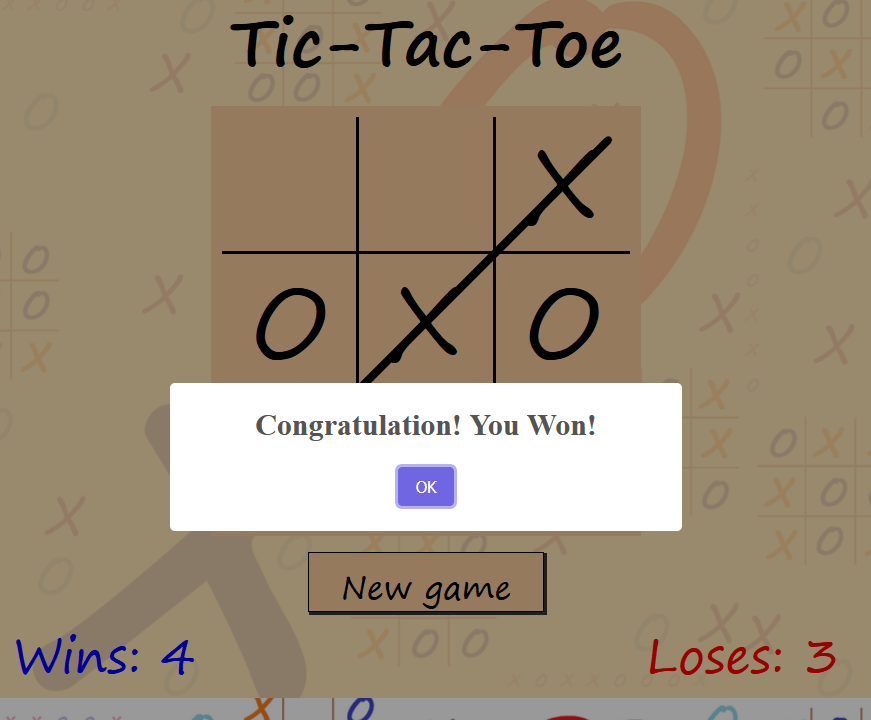

# Tic-Tac-Toe

In the game of Tic Tac Toe, two players take turns marking spaces in a 3x3 grid. The goal is to get three of your symbols (either X or O) in a row, column, or diagonal. Players often strategize to block their opponent's moves while attempting to create their own winning combinations. The game typically ends when one player achieves three in a row or when the grid is completely filled without a winner, resulting in a draw. Tic Tac Toe is a simple yet engaging game that can be enjoyed by people of all ages. Try it here: [tic-tac-toe](https://zoltannyaradi.github.io/Tic-Tac-Toe/).

## Contents

* [Designe](#designe)
  * [Color Scheme](#color-scheme)
  * [Typography](#typography)
*   [Wireframe](#wireframe)
* [Features](#features)
  * [Favicon](#favicon)
  * [Gameboard](#gameboard)
  * [End of The Game Alert](#end-of-the-game-alert)
  * [New Game Button](#new-game-button)
  * [Win and Lose Counter](#win-and-lose-counter)
  * [Future Implementions](#future-implementions)
* [Technologies Used](#technologies-used)
  * [Languages Used](#languages-used)
  * [Used Programs](#used-programs)
* [Deployment & Local Development](#deployment--local-development)
  * [Deployment](#deployment)
  * [Local Development](#local-development)
    * [How to Fork](#how-to-fork)
    * [How to Clone](#how-to-clone)
* [Testing](#testing)
    * [Detailed Testing](#detailed-testing)
    * [Fixed Bugs](#fixed-bugs)
    * [Unsolved Bugs](#unsolved-bugs) 
* [Credits](#credits)
    * [Used Codes](#used-codes)
    * [Acknowledgments](#acknowledgments)

 ## Designe
 
In the background we can see an image with finished and ongoing games and X and O-s in different size.

### Color Scheme

* #FFE0AADD is the background color behind of all elements.
* #F9CC9C is the background color of the gameboard and the buttom.
* #000000 is the color of all texts and lines.
* #FF0000 is the color of the wins.
* #0000FF is the color of the loses.

### Typography

* Segoe Print was used for all text.
* MV Boli was used to make the background.
* Cursive was used as a generic font.

### Wireframe

Balsamiq was used to create the wireframe for 2 phones, tablet, laptop and PC.

## Features

### Favicon

The favion was drawn in Paint 3D.

### Gameboard

The player can place an x on the gameboard, and the bot will response. If someone collect 3 in a line or no more places the game ends. The wining free will be struck.

### End of The Game Alert

When the game ends, an alert informs the player from the result.

### New Game Button

With this button the player clean the board and start a new game.

### Win and Lose Counter

Wins and loses are counted bellow the board.

### Future Implementions

* In the futre will be different difficultes avaible. 
* In every second game the bot will start the game.

## Technologies Used

### Languages Used

HTML, CSS, JavaScript

### Used Programs

* Balsamiq - Used for create wireframe.
* Github - Used to save project and to deploy it.
* Codeanywhere - Used as a developper platform at the beginning.
* Sublime text - Used for modify HTML, CSS, Javascript files.
* Git - Used to manage verisons.
* Paint - Used to create background.
* Paint 3D - Used to create favicons and wining lines.
* tinypng.com - Used to tinify images.
* Am I Responsive - Used to check responsiveness.
* Firefox Developer Tools - Used to review the project.
* ChatGTP - Used to write the introdution of the game.

## Deployment & Local Development
### Deployment

The site is deployed using GitHub Pages - [Tic-Tac-Toe](https://zoltannyaradi.github.io/Tic-Tac-Toe/).

To Deploy the site using GitHub Pages:

1. Login (or signup) to Github.
2. Go to the repository for this project, [ZoltanNyaradi/Tic-Tac-Toe](https://github.com/ZoltanNyaradi/Tic-Tac-Toe/deployments).
3. Click the settings button.
4. Select pages in the left hand navigation menu.
5. From the source dropdown select main branch and press save.
6. The site has now been deployed, please note that this process may take a few minutes before the site goes live.

### Local Development

#### How to Fork

To fork the repository:

1. Log in (or sign up) to Github.
2. Go to the repository for this project, [ZoltanNyaradi/Tic-Tac-Toe](https://github.com/ZoltanNyaradi/Tic-Tac-Toe/deployments).
3. Click the Fork button in the top right corner.

#### How to Clone

To clone the repository:

1. Log in (or sign up) to GitHub.
2. Go to the repository for this project, [ZoltanNyaradi/Tic-Tac-Toe](https://github.com/ZoltanNyaradi/Tic-Tac-Toe/deployments).
3. Click on the code button, select whether you would like to clone with HTTPS, SSH or GitHub CLI and copy the link shown.
4. Open the terminal in your code editor and change the current working directory to the location you want to use for the cloned directory.
5. Type 'git clone' into the terminal and then paste the link you copied in step 3. Press enter.

## Testing

### Detailed Testing

You can find the detailed testing in the [TESTING.md](TESTING.md) file.

### Fixed Bugs

| Bud | Solution |
| --- | --- |
| If the player had a double win, then the alert came two times and the player got two points. | With the result keyword the function had been stoped. | 
| The browser on phone don't have Segoe Print font family. | Gereic font family was added. |

### Unsolved Bugs

If someone conect 3 two times at once, only one of them get stroke.

## Credits

### Used Codes

[Sweetalarm](https://sweetalert2.github.io/) was used in the JavaScript code.

### Acknowledgments

Credit to my mentor Jubril Akolade who helps me on the way to be a developper.
