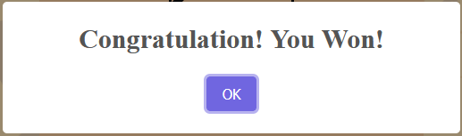
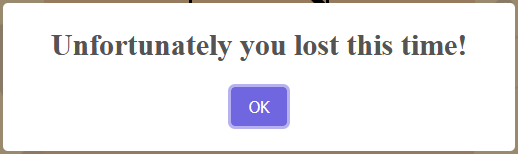

# Testing

## Test with software

### HTML Validator

[validator.w3.org](https://validator.w3.org/) was used to validate HTML code. After correcting a mistype it shows no error.

### CSS Validator

[Jigsaw](https://jigsaw.w3.org/css-validator/) find no error in the CSS file.

### JS Validator

[JSHint](https://jshint.com/) find some missing semicolon. It is corrected.

### Performance, Accessibility, Best Practices, Search Engine Optimization

Google Lighthouse was used to check these. All test passt.

## Manual testing

### Test gameboard

| Feature | Testing Performed | Result | Pass/Fail |
| --- | --- | --- | --- |
| Player can play an X | Clicking on a space | An X appear | Pass |
| Bot place an O after the player | Observ after player move | An O apperas as well | Pass |
| The player can't move till the bot hasn't moved | Clicking againg before the bot moves | Placing is not possible | Pass |
| If someone collect 3 in a line, a line appears on the winning three | Play until finish | The line appears | Pass |
| After someone won, no more move is possible | Clicking after the game is over | No more move is possible | Pass |

### End Game Alerts

After the game is finished one of these alerts appear.

### New Game and Statistic

After clicking the new game button the gameboard become clear. A new game is stared.

After a game is finished the wins or loses updated as it expected.

## Visual Testing

The website looks good on all tested devices.

### Firefox Developer Tool

### Win 10 - Samsung s24f350 monitor

#### Google Chrome

#### Firefox

#### Edge

### Samsung Galaxy S10

